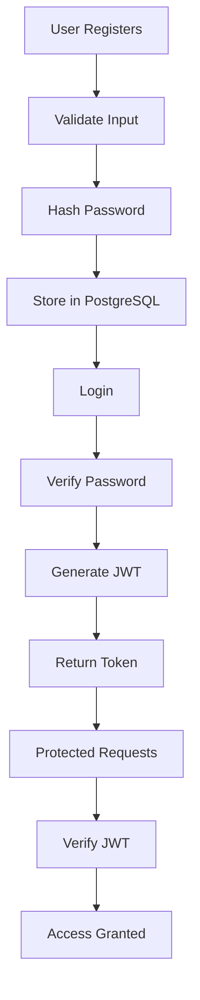
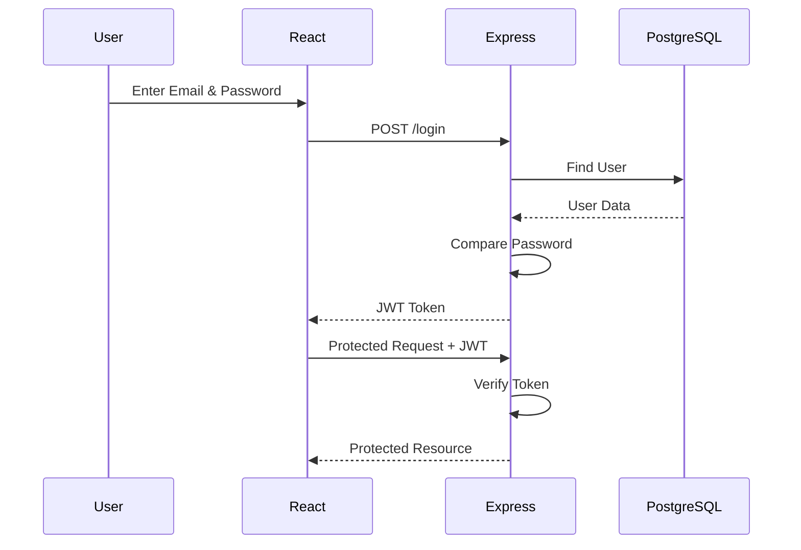
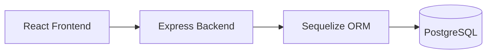
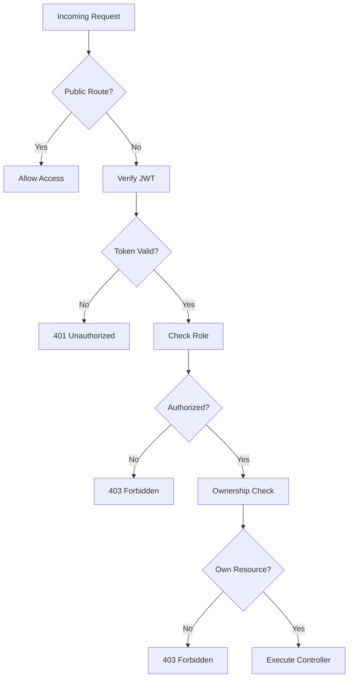

# Multi Hotel Management & Reservation System

## Backend Documentation

---

# 1. Authentication Flow

Authentication is the process of verifying the identity of a user before allowing access to protected resources.

## User Registration

When a new user registers:

1. User submits registration information (Name, Email, Password, etc.).
2. The backend validates the input.
3. The password is hashed using **bcrypt**.
4. The hashed password is stored in PostgreSQL.
5. User data is successfully saved.

Example:

```
Client
   │
   ▼
POST /api/auth/register
   │
   ▼
Validation
   │
   ▼
bcrypt.hash()
   │
   ▼
PostgreSQL
```

---

## User Login

During login:

1. User enters email and password.
2. Backend searches the email in the database.
3. bcrypt compares the entered password with the stored hashed password.
4. If credentials are correct, a JWT token is generated.
5. The token is returned to the client.

---

## JWT Generation

After successful login:

```javascript
const payload = {
    id: user.id,
    role: user.role
};

const token = jwt.sign(payload, process.env.JWT_SECRET, {
    expiresIn: "7d"
});
```

The generated JWT is sent to the frontend.

---

## Protected Requests

For protected APIs:

1. Frontend stores the JWT.
2. Every protected request sends:

```
Authorization: Bearer <JWT_TOKEN>
```

3. Backend verifies the token.
4. If valid, the request proceeds.
5. Otherwise, HTTP 401 Unauthorized is returned.

---

# 2. Password Security

## Why bcrypt is used

bcrypt is a password hashing library designed specifically for securely storing passwords.

Advantages:

- Salt is automatically added.
- Slow hashing prevents brute-force attacks.
- Same password generates different hashes due to random salt.

Example:

Password:

```
password123
```

Stored hash:

```
$2b$10$Y5YtqR6Q9oT...
```

The original password cannot be obtained from the hash.

---

## Why hashing is important

Passwords should never be stored in plain text.

Without hashing:

| Email | Password |
|--------|----------|
| user@gmail.com | password123 |

If the database is compromised, attackers immediately know every password.

With hashing:

| Email | Password |
|--------|-----------|
| user@gmail.com | $2b$10$d8K... |

Attackers only obtain hashes, not actual passwords.

---

## Hashing vs Encryption

| Hashing | Encryption |
|----------|------------|
| One-way process | Two-way process |
| Cannot be reversed | Can be decrypted |
| Used for passwords | Used for sensitive data |
| Uses hash functions | Uses encryption keys |

---

# 3. JSON Web Token (JWT)

JWT is used to securely identify authenticated users.

A JWT has three sections.

```
Header.Payload.Signature
```

Example:

```
eyJhbGciOiJIUzI1NiIsInR5cCI6IkpXVCJ9.
eyJpZCI6IjEyMyIsInJvbGUiOiJPV05FUiJ9.
mY3HcG9wL8vHkP...
```

---

## Header

Contains information about the token.

Example:

```json
{
  "alg": "HS256",
  "typ": "JWT"
}
```

---

## Payload

Contains application data.

Example:

```json
{
  "id": "12345",
  "role": "OWNER"
}
```

---

## Signature

Created using:

- Header
- Payload
- Secret Key

Purpose:

- Prevents tampering
- Verifies authenticity

---

# JWT Structure

```
+-----------------+---------------------+--------------------+
| Header          | Payload             | Signature          |
+-----------------+---------------------+--------------------+
| Algorithm       | User ID             | Secret Key Hash    |
| Token Type      | User Role           |                    |
+-----------------+---------------------+--------------------+
```

---

# 4. Role-Based Access Control (RBAC)

RBAC restricts system functionality based on user roles.

The system supports three roles:

- ADMIN
- OWNER
- CUSTOMER

---

## Authentication

Authentication verifies **who the user is**.

Performed using JWT.

Flow:

```
Login
   │
   ▼
JWT Generated
   │
   ▼
Protected Route
```

---

## Authorization

Authorization determines **what the user is allowed to do**.

Examples:

| Role | Permissions |
|------|-------------|
| Admin | Manage users, approve hotels, view all bookings |
| Owner | Manage own hotels and rooms |
| Customer | Create and manage own bookings |

Example middleware:

```javascript
authorize("OWNER")
```

Only owners can access owner routes.

---

## Ownership Check

Even if two users have the same role, they cannot modify each other's resources.

Example:

Owner A owns Hotel A.

Owner B cannot update Hotel A.

Backend verification:

```javascript
if (hotel.ownerId !== req.user.id) {
    throw new Error("Forbidden");
}
```

This prevents unauthorized modifications.

---

# 5. Mermaid Diagrams

## Authentication Flowchart



---

## Login Sequence Diagram



---

## Architecture Diagram



---

## Route Protection Decision Tree



---

# Conclusion

The backend of the Multi Hotel Management & Reservation System is built using:

- Node.js
- Express.js
- Sequelize ORM
- PostgreSQL
- JWT Authentication
- bcrypt Password Hashing
- Role-Based Access Control (RBAC)

The application follows the MVC architecture and implements secure authentication, authorization, ownership verification, hotel management, room management, booking management, and admin approval workflows.
